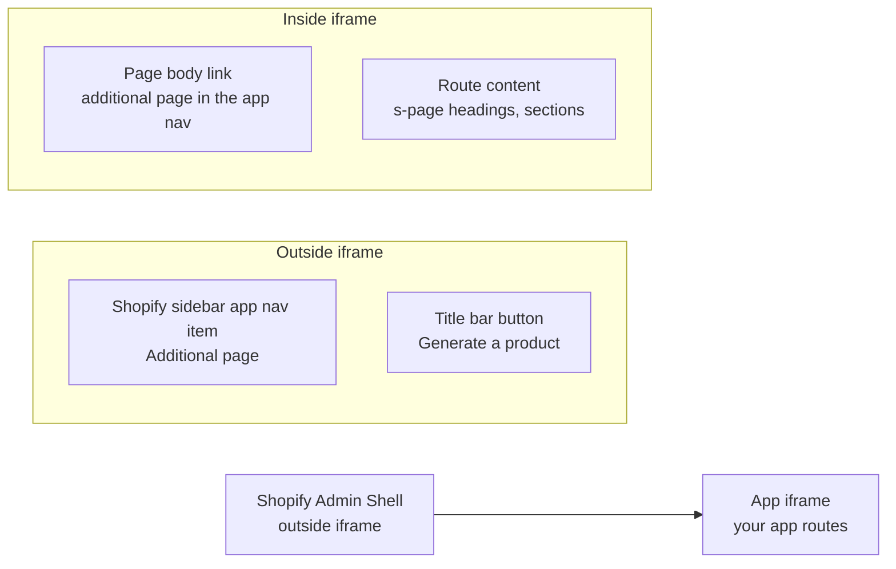
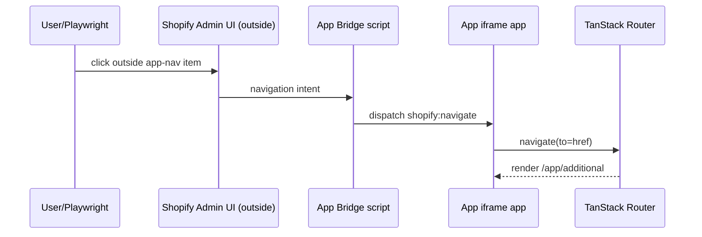
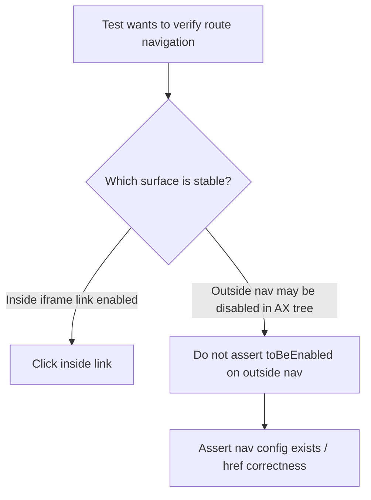

# App Bridge nav testing research

## TL;DR

You are seeing two different nav surfaces, not one superimposed element.

- Outside link: Shopify admin chrome nav (outside iframe), mirrored from App Bridge nav config.
- Inside link: regular app content link inside the iframe page body.
- In this env, the outside sidebar `Additional page` link is often exposed as disabled in the accessibility tree, while the inside link is enabled.
- That is why Playwright `toBeEnabled()` fails on outside link but route navigation still works via inside link.

## Grounded facts from this repo + refs

### 1) Shopify app runs in an iframe, App Bridge controls outside UI

From Shopify docs:

> "The App Home area in Shopify admin is implemented as an iframe." (`refs/shopify-docs/docs/api/app-home.md:42`)

> "Use App Bridge ... to add UI elements such as title bars and navigation menus to other parts of Shopify admin outside the app's iframe." (`refs/shopify-docs/docs/api/app-home.md:44`)

> "With App Bridge web components you can add UI elements like title bars and navigation menus to the main Shopify admin area outside of your app's iframe." (`refs/shopify-docs/docs/api/app-home.md:113`)

### 2) Your app defines App Bridge nav in layout route

`src/routes/app.tsx:110`:

```tsx
<s-app-nav>
  <s-link href={`/app${searchStr}`}>Home</s-link>
  <s-link href={`/app/additional${searchStr}`}>Additional page</s-link>
</s-app-nav>
```

This is same pattern as Shopify template (`refs/shopify-app-template/app/routes/app.tsx:20`).

### 3) Your app also has a normal in-page link inside iframe content

`src/routes/app.index.tsx:211`:

```tsx
<s-link href="/app/additional">additional page in the app nav</s-link>
```

This is a normal page-body link rendered inside iframe content.

### 4) App Bridge navigation is event-bridged

Your `AppProvider` listens for `shopify:navigate` and routes with TanStack:

`src/components/AppProvider.tsx:18` and `src/components/AppProvider.tsx:14`.

This matches Shopify's react-router provider implementation in refs (`refs/shopify-app-js/packages/apps/shopify-app-react-router/src/react/components/AppProvider/AppProvider.tsx:125`).

### 5) The failed run shows outside nav link disabled, inside link enabled

From Playwright error context:

- Outside sidebar: `link "Additional page" [disabled]` (`playwright/test-results/nav-additional-page-nav-to-additional-page-renders-heading-e2e/error-context.md:167`)
- Outside title bar button is enabled/visible (`...error-context.md:205`)
- Inside iframe link exists: `link "additional page in the app nav"` (`...error-context.md:226`)

So readiness of the outside title bar button does not imply outside sidebar nav link is enabled.

### 6) Why Playwright fails fast on that link

Playwright actionability rules:

> "Element is considered enabled when it is not disabled." (`refs/playwright/docs/src/actionability.md:96`)

> "Element is disabled when ... it is a descendant of an element with `[aria-disabled=true]`." (`refs/playwright/docs/src/actionability.md:101`)

So `expect(locator).toBeEnabled()` is strict by design; host UI disabled semantics in the outside nav will fail it.

## Visualization







## Why manual click can appear to work

Most likely one of these:

1. You click a different hit target than Playwright asserted (for example parent row/button in Shopify chrome), while Playwright targets the specific disabled link node.
2. Interactive state can differ moment-to-moment in Shopify chrome; AX/DOM disabled state and pointer behavior do not always align perfectly in custom host UI.
3. There may be host-level click handling that still routes even when descendant link is marked disabled.

What we can prove from artifacts: in the failing run, Playwright repeatedly resolved the same outside link and saw it disabled for 60s.

## Practical testing split (recommended)

Use two test intents instead of one mixed assertion:

1. Route navigation behavior (reliable): click inside iframe link and assert destination page heading.
2. App Bridge nav integration (presence contract): assert outside app-nav item exists and has expected href pattern; avoid `toBeEnabled()` hard requirement for this env.

Current working spec uses this split implicitly: it gates on outside readiness signal (title bar button) and performs navigation click inside iframe (`e2e/nav-additional-page.spec.ts:10`, `e2e/nav-additional-page.spec.ts:15`).

## Extra debugging recipe for future flakes

- Run with trace: `npm run test:e2e -- e2e/nav-additional-page.spec.ts --project=e2e --trace on --headed`
- Inspect actionability + AX tree in trace viewer.
- At failure, capture attributes for outside link (`disabled`, `aria-disabled`, `href`) and compare with hit target element under cursor.
