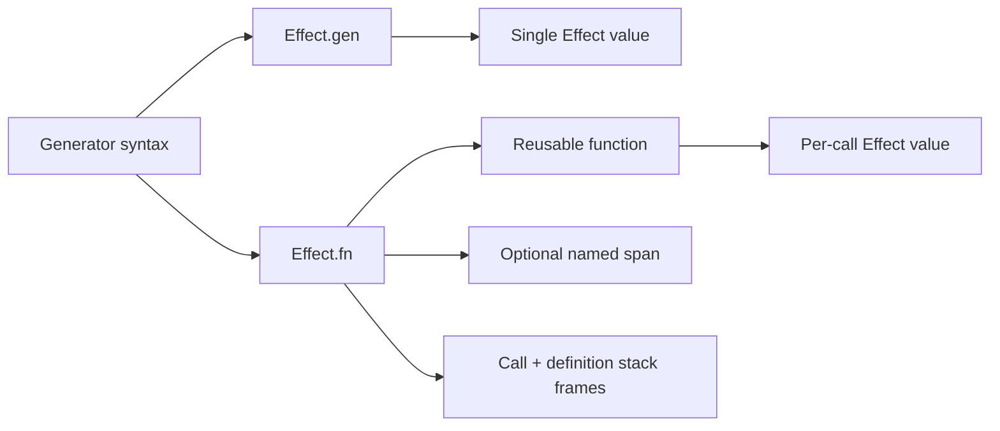

# Effect 4 Research: `Effect.gen` vs `Effect.fn`

## Scope

Sources reviewed:

- `refs/effect4/LLMS.md`
- `refs/effect4/packages/effect/src/Effect.ts`
- `refs/effect4/packages/effect/src/internal/effect.ts`
- `refs/effect4/ai-docs/src/01_effect/01_basics/01_effect-gen.ts`
- `refs/effect4/ai-docs/src/01_effect/01_basics/02_effect-fn.ts`
- `refs/effect4/ai-docs/src/03_integration/10_managed-runtime.ts`
- `refs/effect4/ai-docs/src/70_cli/10_basics.ts`
- `refs/effect4/migration/generators.md`

## Short Answer

`Effect.gen` and `Effect.fn` are related, not the same.

- `Effect.gen`: build one `Effect<A, E, R>` program value with generator syntax.
- `Effect.fn`: build a reusable function `(...args) => Effect<A, E, R>` from a generator body.

They solve different boundaries:

- `gen` solves effect workflow readability.
- `fn` solves reusable effect-function definition, naming, tracing, and call-site stack metadata.

Not fully interchangeable in practice.

## What They Are

### `Effect.gen`

Type shape from `Effect.ts`:

```ts
export const gen: {
  <Eff extends Yieldable<any, any, any, any>, AEff>(
    f: () => Generator<Eff, AEff, never>
  ): Effect<AEff, ...>
}
```

Source: `refs/effect4/packages/effect/src/Effect.ts:1564-1590`

Doc intent:

- "`gen` allows you to write code that looks and behaves like synchronous code".

Source: `refs/effect4/packages/effect/src/Effect.ts:1522-1525`

### `Effect.fn`

Export and docs:

```ts
export const fn: fn.Traced & {
  (name: string, options?: SpanOptionsNoTrace): fn.Traced;
} = internal.fn;
```

Source: `refs/effect4/packages/effect/src/Effect.ts:12849-12851`

Doc intent:

- "Creates a traced function ... adds spans and stack frames".

Source: `refs/effect4/packages/effect/src/Effect.ts:12823-12825`

Team guidance explicitly says:

- "When writing functions that return an Effect, use `Effect.fn`"
- "Avoid creating functions that return an `Effect.gen`, use `Effect.fn` instead."

Source: `refs/effect4/LLMS.md:48-52`

## Internal Mechanics (Why Behavior Differs)

Both are generator-based under the hood:

```ts
export const gen = (...) =>
  suspend(() => fromIteratorUnsafe(...))
```

Source: `refs/effect4/packages/effect/src/internal/effect.ts:1072-1093`

`fn` wraps that per call and adds function-level behavior:

- optional named span when first arg is a string
- call stack + definition stack frame enrichment
- optional post-processing pipeables
- preserves function arity (`length`)

Grounding excerpts:

```ts
const nameFirst = typeof arguments[0] === "string"
const name = nameFirst ? arguments[0] : "Effect.fn"
...
addSpan ? useSpan(name, spanOptions!, ...) : result
...
name: `${name} (definition)`
```

Source: `refs/effect4/packages/effect/src/internal/effect.ts:1124-1126`, `1176-1178`, `1184`

## What Problem Each Solves

### `Effect.gen` solves

- readable sequential orchestration
- local control flow (`if`, loops, early returns)
- easy composition of multiple `yield*` operations

### `Effect.fn` solves

- reusable effectful API surface (`repo.getById(id)`, `service.create(input)`)
- standardized instrumentation and call-site debuggability
- concise attachment of combinators at function definition

## Why Both Needed

If only `gen` existed, reusable effect methods become ad-hoc wrappers and instrumentation is easy to forget.

If only `fn` existed, one-off workflows become noisy (`const run = Effect.fn(...); yield* run()`), especially where no function boundary is needed.

They map to two different levels:

- program/workflow value (`gen`)
- reusable effect function API (`fn`)



## Are They Interchangeable?

Partially, functionally; no, architecturally.

You can write:

```ts
const getUser = (id: string) =>
  Effect.gen(function* () {
    return yield* fetchUserById(id);
  });
```

But guidance prefers:

```ts
const getUser = Effect.fn("UserService.getUser")(function* (id: string) {
  return yield* fetchUserById(id);
});
```

Reason: `fn` captures a stable function boundary and can attach span/stack behavior centrally.

So, "basically interchangeable" only for tiny/simple cases where tracing and function-level ergonomics do not matter.

## When To Use Which

Use `Effect.gen` when:

- building a top-level program value
- orchestrating a one-off workflow inside a loader/handler/layer construction
- no reusable API boundary needed

Use `Effect.fn` when:

- defining a named method/function that returns an `Effect`
- the function will be called from multiple places
- you want trace/span and stack context bound to function identity

Use `Effect.fn` without a name when:

- you still want fn ergonomics but do not want/need a named span
- example exists in CLI handlers

Source example: `refs/effect4/ai-docs/src/70_cli/10_basics.ts:42`, `73`

```mermaid
flowchart TD
  A[Need generator-style Effect code] --> B{Reusable function API?}
  B -->|No| C[Use Effect.gen]
  B -->|Yes| D{Need function-level tracing name?}
  D -->|Yes| E[Use Effect.fn("Name")]
  D -->|No| F[Use Effect.fn(...)]
```

## Concrete Patterns From Effect Docs

### Pattern 1: workflow with `gen`

```ts
const program = Effect.gen(function* () {
  const transactionAmount = yield* fetchTransactionAmount;
  const discountRate = yield* fetchDiscountRate;
  const discountedAmount = yield* applyDiscount(
    transactionAmount,
    discountRate,
  );
  return `Final amount to charge: ${discountedAmount}`;
});
```

Source: `refs/effect4/packages/effect/src/Effect.ts:1549-1558`

### Pattern 2: service methods with `fn`

```ts
const getById = Effect.fn("TodoRepo.getById")(function* (id: number) {
  const todo = store.get(id);
  if (todo === undefined) return yield* new TodoNotFound({ id });
  return todo;
});

const create = Effect.fn("TodoRepo.create")(function* (
  payload: CreateTodoPayload,
) {
  const id = yield* Ref.getAndUpdate(nextId, (current) => current + 1);
  const todo = new Todo({ id, title: payload.title, completed: false });
  store.set(id, todo);
  return todo;
});
```

Source: `refs/effect4/ai-docs/src/03_integration/10_managed-runtime.ts:40-53`

## Additional Note: `this` binding in v4

`Effect.gen` with `this` now uses options object:

```ts
compute = Effect.gen({ self: this }, function* () {
  return yield* Effect.succeed(this.local + 1);
});
```

Source: `refs/effect4/migration/generators.md:23-31`

`Effect.fn` also supports `self`-style options in type signatures (`fn.Traced`) for method-style usage.

Source: `refs/effect4/packages/effect/src/Effect.ts:10362+`

## Final Guidance

- Default style: `Effect.gen` for workflows, `Effect.fn("name")` for effect-returning functions.
- Do not treat them as drop-in equivalents across a codebase.
- If in doubt: if you are naming an operation as a callable method, use `Effect.fn`.

## Codebase Analysis: `Effect.gen` → `Effect.fn` Candidates

Zero `Effect.fn` usage found. All 70+ effect generators use `Effect.gen`. Below categorizes every `Effect.gen` site by whether it should migrate to `Effect.fn`.

### Should Use `Effect.fn` — Service Methods (Reusable Named Functions)

These are functions assigned to object properties inside service `make` blocks. They accept arguments, are called from multiple sites, and represent a named API boundary. Classic `Effect.fn` territory.

| File                        | Function                                 | Suggested Name                              |
| --------------------------- | ---------------------------------------- | ------------------------------------------- |
| `src/lib/Stripe.ts:53`      | `getPrices()`                            | `"Stripe.getPrices"`                        |
| `src/lib/Stripe.ts:112`     | `getPlans()`                             | `"Stripe.getPlans"`                         |
| `src/lib/Stripe.ts:178`     | `ensureBillingPortalConfiguration()`     | `"Stripe.ensureBillingPortalConfiguration"` |
| `src/lib/Repository.ts:10`  | `getUser(email)`                         | `"Repository.getUser"`                      |
| `src/lib/Repository.ts:31`  | `getUsers({limit, offset, searchValue})` | `"Repository.getUsers"`                     |
| `src/lib/Repository.ts:90`  | `getAppDashboardData({...})`             | `"Repository.getAppDashboardData"`          |
| `src/lib/Repository.ts:160` | `getAdminDashboardData()`                | `"Repository.getAdminDashboardData"`        |
| `src/lib/Repository.ts:198` | `getCustomers({...})`                    | `"Repository.getCustomers"`                 |
| `src/lib/Repository.ts:281` | `getSubscriptions({...})`                | `"Repository.getSubscriptions"`             |
| `src/lib/Repository.ts:395` | `getSessions({...})`                     | `"Repository.getSessions"`                  |

**Why:** These are reusable effectful methods on a service object, called from route handlers and other services. `Effect.fn("Name")` adds per-call tracing spans and definition-site stack frames — exactly what `fn` was designed for. Currently these methods have zero instrumentation; `fn` would give tracing for free.

### Should Use `Effect.fn` — Exported Effect-Returning Functions

Standalone exported functions that accept arguments and return an `Effect`. Called from multiple sites or represent a clear API boundary.

| File                                 | Function                                 | Suggested Name                            |
| ------------------------------------ | ---------------------------------------- | ----------------------------------------- |
| `src/lib/google-oauth-client.ts:53`  | `buildGoogleAuthorizationRequest(input)` | `"GoogleOAuth.buildAuthorizationRequest"` |
| `src/lib/google-oauth-client.ts:81`  | `exchangeGoogleAuthorizationCode(input)` | `"GoogleOAuth.exchangeAuthorizationCode"` |
| `src/lib/google-oauth-client.ts:106` | `refreshGoogleToken(input)`              | `"GoogleOAuth.refreshToken"`              |

**Why:** Named functions that return Effects. Each represents a distinct API operation. `fn` attaches tracing to every call without manual `withLogSpan` boilerplate.

### Keep `Effect.gen` — Service `make` Blocks (Layer Construction)

These are one-off workflows that build a service layer. No reusable function boundary — they run once during layer construction.

| File                      | Line              |
| ------------------------- | ----------------- |
| `src/lib/D1.ts:13`        | `D1.make`         |
| `src/lib/Repository.ts:7` | `Repository.make` |
| `src/lib/Stripe.ts:46`    | `Stripe.make`     |
| `src/lib/Auth.ts:350`     | `Auth.make`       |

**Why:** `make` is a one-shot layer construction workflow. No function boundary, no arguments, no reuse. `Effect.gen` is correct.

### Keep `Effect.gen` — Route Handler / Server Function Bodies

Inline `Effect.gen` inside `createServerFn` handlers and worker `fetch`/`scheduled` callbacks. These are one-off orchestration workflows scoped to a single request handler.

| File                                                           | Context                                                           |
| -------------------------------------------------------------- | ----------------------------------------------------------------- |
| `src/worker.ts:141,158,178,199`                                | `onBeforeConnect`, `onBeforeRequest`, session fetch, cron handler |
| `src/routes/admin.users.tsx:87,121,139`                        | `getUsers`, `unbanUser`, `impersonateUser` server fns             |
| `src/routes/admin.users.tsx:372`                               | `banUser` server fn                                               |
| `src/routes/admin.tsx:40`                                      | admin loader                                                      |
| `src/routes/login.tsx:36,53`                                   | login server fns                                                  |
| `src/routes/app.tsx:8`                                         | app loader                                                        |
| `src/routes/app.index.tsx:8`                                   | app index loader                                                  |
| `src/routes/app.$organizationId.tsx:45,62`                     | org layout loader/server fn                                       |
| `src/routes/app.$organizationId.billing.tsx:41,265,289,314`    | billing loader/server fns                                         |
| `src/routes/app.$organizationId.index.tsx:48,69,95`            | org index server fns                                              |
| `src/routes/app.$organizationId.members.tsx:54,99,119,139`     | members server fns                                                |
| `src/routes/app.$organizationId.invitations.tsx:65,160,328`    | invitations server fns                                            |
| `src/routes/app.$organizationId.upload.tsx:82,124,155`         | upload server fns                                                 |
| `src/routes/app.$organizationId.google.tsx:54`                 | google oauth server fn                                            |
| `src/routes/app.$organizationId.inspector.tsx:10`              | inspector loader                                                  |
| `src/routes/app.$organizationId.workflow.tsx:40`               | workflow loader                                                   |
| `src/routes/admin.customers.tsx:48`                            | customers loader                                                  |
| `src/routes/admin.sessions.tsx:48`                             | sessions loader                                                   |
| `src/routes/admin.subscriptions.tsx:48`                        | subscriptions loader                                              |
| `src/routes/_mkt.pricing.tsx:30,50`                            | pricing loader/server fn                                          |
| `src/routes/login-callback.tsx:8`                              | login-callback loader                                             |
| `src/routes/api/auth/$.tsx:24,31`                              | auth API handler                                                  |
| `src/routes/api/google/callback.tsx:13`                        | google callback handler                                           |
| `src/routes/api/org.$organizationId.upload-image.$name.tsx:11` | upload API handler                                                |
| `src/routes/api/e2e/delete/user/$email.tsx:13`                 | e2e delete handler                                                |

**Why:** These are anonymous one-off workflows inside request handlers. No named function boundary, not called from multiple sites. `Effect.gen` is the right tool.

### Keep `Effect.gen` — Callback/Hook Bodies Inside `Auth.ts`

Inline generators inside better-auth hooks and plugin callbacks. These are deeply nested, anonymous, and tied to the hook framework's callback shape.

| File                  | Lines                                  | Context |
| --------------------- | -------------------------------------- | ------- |
| `src/lib/Auth.ts:125` | hooks.before middleware                |
| `src/lib/Auth.ts:147` | magicLink.sendMagicLink                |
| `src/lib/Auth.ts:196` | stripe.subscription.plans              |
| `src/lib/Auth.ts:250` | stripe.subscription.authorizeReference |
| `src/lib/Auth.ts:383` | databaseHookUserCreateAfter            |
| `src/lib/Auth.ts:420` | databaseHookSessionCreateBefore        |
| `src/lib/Auth.ts:489` | signOutServerFn                        |

**Why:** Callbacks passed to third-party plugin APIs. The function shape is dictated by the plugin, not our API surface. These already use manual `withLogSpan`/`annotateLogs` for tracing. Converting would require wrapping in `fn` then immediately invoking, adding noise.

### Summary

| Category                         | Count | Action            |
| -------------------------------- | ----- | ----------------- |
| Service methods → `Effect.fn`    | 10    | Migrate           |
| Exported functions → `Effect.fn` | 3     | Migrate           |
| Service `make` blocks            | 4     | Keep `Effect.gen` |
| Route handler bodies             | ~30   | Keep `Effect.gen` |
| Auth callback bodies             | 7     | Keep `Effect.gen` |

**Highest-value migrations:** `Repository` methods (7) and `Stripe` methods (3). These are the most-called service methods, currently have zero tracing, and `Effect.fn` would add named spans automatically.
