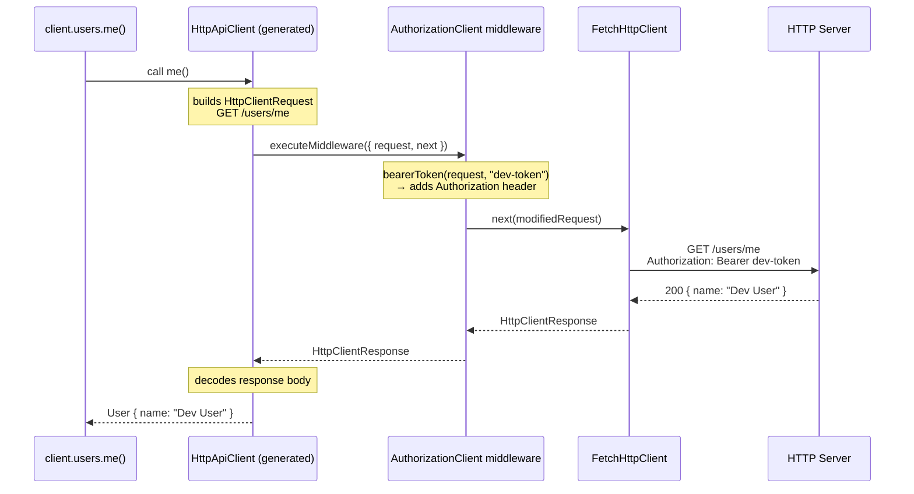
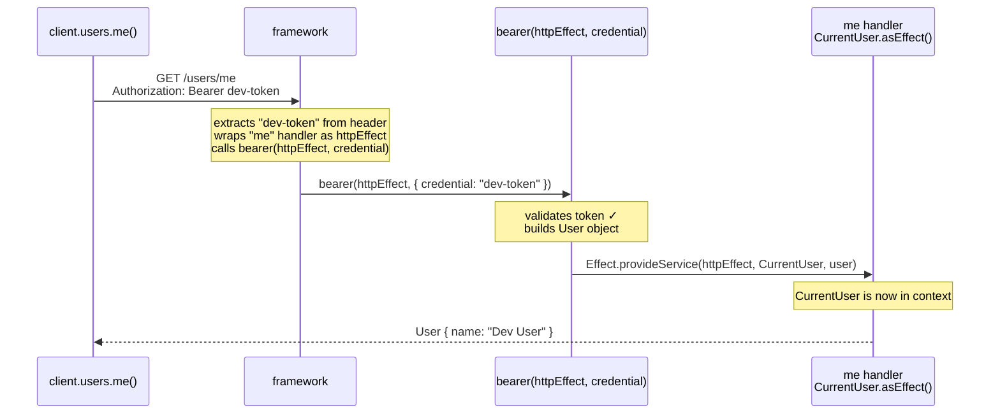

# Effect v4: Per-Execution Injection (`Effect.provideService`)

Instead of building a layer, inject a single service instance directly into an in-flight effect at the point it is run.

## `Effect.provideService` signature

`refs/effect4/packages/effect/src/Effect.ts:5929`

```ts
export const provideService: {
  <I, S>(service: Context.Key<I, S>): {
    (implementation: S): <A, E, R>(self: Effect<A, E, R>) => Effect<A, E, Exclude<R, I>>
    <A, E, R>(self: Effect<A, E, R>, implementation: S): Effect<A, E, Exclude<R, I>>
  }
  <I, S>(service: Context.Key<I, S>, implementation: S):
    <A, E, R>(self: Effect<A, E, R>) => Effect<A, E, Exclude<R, I>>
  <A, E, R, I, S>(self: Effect<A, E, R>, service: Context.Key<I, S>, implementation: S):
    Effect<A, E, Exclude<R, I>>
}
```

`Exclude<R, I>` — the service requirement `I` is removed from the type after injection. The returned effect no longer requires `I` from the caller.

## Example — HTTP auth middleware

`refs/effect4/ai-docs/src/51_http-server/fixtures/server/Authorization.ts:24`
`refs/effect4/ai-docs/src/51_http-server/10_basics.ts:68`

### What is `HttpApiMiddleware`?

When a request comes in for `GET /users/me`, two pieces of code are involved:

- **The handler** — the function you wrote for the `me` endpoint. Its job is to return user data. It does the actual work the client asked for.
- **The middleware** — code that runs *before* the handler. Its job is to check the bearer token.

```
request arrives
    ↓
middleware runs first
    ↓ (if token valid)
handler runs
    ↓
response sent
```

The unusual thing about Effect middleware vs Express: the middleware receives the handler as an object it can hold and run (or not run). If the token is invalid, the middleware returns an error and the handler is never called. If valid, the middleware wraps the handler with `Effect.provideService` to inject `CurrentUser`, then runs it.

In the code, the handler passed to the middleware is called `httpEffect` — "effect" because in Effect-land everything is an `Effect<...>`.

#### It is a service class

`HttpApiMiddleware.Service` produces a `Context.Service` tag — the same kind you use anywhere in Effect. The tag's *value* is a function (the middleware). You provide an implementation via a `Layer`, just like any other service.

```ts
// fixtures/api/Authorization.ts:16
export class Authorization extends HttpApiMiddleware.Service<Authorization, {
  provides: CurrentUser   // ← service it puts into the handler's context
  requires: never
}>()("acme/HttpApi/Authorization", {
  requiredForClient: true,
  security: { bearer: HttpApiSecurity.bearer },
  error: Unauthorized     // ← typed errors it can raise
}) {}
```

Key config fields:

| field | what it does |
|---|---|
| `provides` | Service the middleware puts into the handler's context (e.g. `CurrentUser`) |
| `requires` | Services *this* middleware itself needs |
| `error` | Typed errors the middleware can raise (appear in OpenAPI and client types) |
| `security` | Security schemes (`bearer`, `apiKey`, …). The framework automatically extracts credentials from the request and passes them to the middleware. |
| `requiredForClient` | When `true`, the generated HTTP client also requires a client-side implementation (to attach credentials to outgoing requests) |

#### Two sides of the same definition

The single `Authorization` class definition is shared between server and client, but each side provides a different implementation:

```
Authorization (class — shared API contract)
  │
  ├── server impl (AuthorizationLayer)
  │     receives: the handler (not yet run) + extracted bearer credential
  │     job: validate token → inject CurrentUser → run the handler
  │
  └── client impl (AuthorizationClient)
        receives: outgoing request + next()
        job: attach bearer token → call next(modifiedRequest)
```

This is the central design: one definition, two implementations, matched by the framework at each end of the wire.

#### How the framework calls the server-side middleware

The server-side middleware value is a record keyed by security scheme name. For `Authorization` with `security: { bearer: ... }`, the value is `{ bearer: (httpEffect, { credential }) => Effect<...> }`.

The framework:
1. Extracts the bearer token from the `Authorization` header
2. Calls `bearer(httpEffect, { credential })` — passing the handler (not yet run) and the extracted token
3. The middleware wraps the handler with `Effect.provideService` and runs it

If the token is invalid the middleware returns `Unauthorized` and the handler is never called.

#### How the framework calls the client-side middleware

The client-side middleware is a function `({ request, next }) => Effect<HttpClientResponse>`. The framework calls it for each outgoing request. The middleware modifies the request (adds headers, retries, logs) and calls `next(request)` to send it. At the bottom of the chain `next` is `httpClient.execute` — the actual network call.


### Step 1 — the handler needs a `CurrentUser`

First, what `handle` expects. From `HttpApiEndpoint.ts:593`:

```ts
type Handler<Endpoint, E, R> = (
  request: Request<Endpoint>
) => Effect<SuccessType, ErrorType, R>
//   ^^^^^^ must return an Effect
```

The handler must be a function that returns an `Effect`. So this would be a TypeScript error:

```ts
.handle("me", () => CurrentUser)  // ✗ CurrentUser is a tag, not an Effect
```

`CurrentUser` is a tag — it is the key used to look up a value in the context. It is not a value itself, and it is not an `Effect`.

`.asEffect()` is a method on every `Context.Service` tag. It converts the tag into an `Effect` that reads the service out of context and returns it. From `Context.ts:49`:

```ts
asEffect(): Effect<Shape, never, Identifier>
//          Effect<User,  never, CurrentUser>  ← for CurrentUser specifically
```

So these three are identical:

```ts
// 1. using asEffect()
.handle("me", () => CurrentUser.asEffect())

// 2. using yield* inside Effect.gen
.handle("me", () =>
  Effect.gen(function*() {
    return yield* CurrentUser
  })
)

// 3. explicit — just to make the lookup visible
.handle("me", () =>
  Effect.gen(function*() {
    const user = yield* CurrentUser  // reads User out of context
    return user
  })
)
```

All three return `Effect<User, never, CurrentUser>` — an effect that, when run, looks up `CurrentUser` in the context and returns the `User` stored there.

The handler doesn't know anything about tokens. It just asks for `CurrentUser` and expects something to have put it in the context before this runs.

### Step 2 — `bearer` is the thing that puts `CurrentUser` in the context

`bearer` is a function. It receives two arguments:
- `httpEffect` — the downstream handler effect (the `me` handler above), not yet run
- `credential` — the bearer token extracted from the request header

```ts
// server/Authorization.ts
bearer: Effect.fn(function*(httpEffect, { credential }) {

  // validate the token
  if (Redacted.value(credential) !== "dev-token") {
    return yield* new Unauthorized({ message: "Missing or invalid bearer token" })
  }

  // token is valid — build the user and inject it into the handler effect
  const user = new User({ id: UserId.make(1), name: "Dev User", email: "dev@acme.com" })

  return yield* Effect.provideService(
    httpEffect,   // the "me" handler — CurrentUser.asEffect()
    CurrentUser,  // the tag to inject
    user          // the value
  )
  // now when httpEffect runs, CurrentUser.asEffect() resolves to `user`
})
```

`Effect.provideService(httpEffect, CurrentUser, user)` wraps `httpEffect` so that when it runs, `CurrentUser` is already in its context. The handler never sees this wiring.

### Step 3 — the client sends the token

#### Background: why the client needs middleware at all

The `Authorization` middleware was declared with `requiredForClient: true`:

```ts
// fixtures/api/Authorization.ts:16
export class Authorization extends HttpApiMiddleware.Service<Authorization, {
  provides: CurrentUser
  requires: never
}>()("acme/HttpApi/Authorization", {
  requiredForClient: true,   // ← client must also provide an impl
  security: { bearer: HttpApiSecurity.bearer },
  error: Unauthorized
}) {}
```

`requiredForClient: true` means TypeScript enforces that anyone building a typed client provides a client-side implementation. `HttpApiClient.make` requires `ForClient<Authorization>` in its context — without it, the type error prevents compilation. It's the compile-time way of saying "every caller must supply auth credentials."

#### What is `ForClient<Authorization>`?

`Authorization` is the server-side tag — it identifies the server's middleware implementation in the Effect context.

`ForClient<Authorization>` is a separate tag that identifies the *client-side* implementation of the same middleware. It's a different tag so TypeScript can tell the two apart and enforce that each side provides the right kind of implementation.

Think of it as two slots that need to be filled:

```
Authorization        → filled by AuthorizationLayer  (server: validates tokens, injects CurrentUser)
ForClient<Authorization> → filled by AuthorizationClient (client: attaches token to outgoing requests)
```

`HttpApiClient.make` looks at the API definition, sees `requiredForClient: true` on `Authorization`, and adds `ForClient<Authorization>` to its required context. If you don't provide it, TypeScript errors before you can even run anything.

#### What is a `Layer`?

An `Effect<A, E, R>` declares that it *needs* services listed in `R` before it can run. A `Layer<S>` is a recipe for *building* service `S`. Providing a layer to an effect satisfies one of its requirements.

```
Effect<User, never, ForClient<Authorization>>
                    ^^^^^^^^^^^^^^^^^^^^^^^^^
                    "I need this service to run"

Layer<ForClient<Authorization>>
     ^^^^^^^^^^^^^^^^^^^^^^^^^
     "I know how to build this service"

Effect.provide(someEffect, someLayer)
→ Effect<User, never, never>   ← requirement satisfied, effect can now run
```

A Layer is not the service value itself — it's the *construction logic*. This matters because some services need resources (database connections, HTTP clients) that must be set up once and torn down cleanly. A Layer encapsulates that lifecycle.

For the simple case here, think of a Layer as just a named box containing the service value:

```
Layer<ForClient<Authorization>>  =  box labeled "ForClient<Authorization>"
                                     containing the client middleware function
```

`Layer.provide(AuthorizationClient)` in the `ApiClient.layer` chain hands that box to `HttpApiClient.make`, which opens it, takes out the function, and uses it to intercept outgoing requests.

#### What `HttpApiMiddleware.layerClient` does

`layerClient` takes your client-side function and wraps it in a `Layer` — i.e. puts it in the correctly-labeled box so `HttpApiClient.make` can find it:

```ts
// HttpApiMiddleware.ts:362
export const layerClient = <Id extends AnyId, S, R, ...>(
  tag: Context.Key<Id, S>,
  service: HttpApiMiddlewareClient<...> | Effect.Effect<HttpApiMiddlewareClient<...>, ...>
): Layer.Layer<ForClient<Id>, ...>
```

The interceptor function (`HttpApiMiddlewareClient`) has this shape:

```ts
// HttpApiMiddleware.ts:77
interface HttpApiMiddlewareClient<_E, CE, R> {
  (options: {
    readonly endpoint: HttpApiEndpoint.AnyWithProps
    readonly group: HttpApiGroup.AnyWithProps
    readonly request: HttpClientRequest.HttpClientRequest
    readonly next: (
      request: HttpClientRequest.HttpClientRequest
    ) => Effect.Effect<HttpClientResponse.HttpClientResponse, HttpClientError.HttpClientError>
  }): Effect.Effect<HttpClientResponse.HttpClientResponse, CE | HttpClientError.HttpClientError, R>
}
```

It receives: the outgoing `request` and a `next` function that sends the request down the chain (either to the next middleware, or ultimately to the HTTP client). It returns the response.

#### The actual client middleware

```ts
// 10_basics.ts:68
const AuthorizationClient = HttpApiMiddleware.layerClient(
  Authorization,
  Effect.fn(function*({ next, request }) {
    return yield* next(HttpClientRequest.bearerToken(request, "dev-token"))
  })
)
```

- receives the outgoing `request` (e.g., `GET /users/me`)
- calls `HttpClientRequest.bearerToken(request, "dev-token")` — clones the request and adds `Authorization: Bearer dev-token`
- calls `next(modifiedRequest)` — sends the modified request to the server
- returns the response

#### How the generated client wires it up

`HttpApiClient.make` builds typed method functions for every endpoint. Internally, for each request it calls `executeMiddleware`:

```ts
// HttpApiClient.ts:216
function executeMiddleware(group, endpoint, request, middlewareKeys, index) {
  if (index === -1) {
    return httpClient.execute(request)   // base case: actually send the HTTP request
  }
  const middleware = services.mapUnsafe.get(middlewareKeys[index])
  // ...
  return middleware({
    endpoint, group, request,
    next(request) {
      return executeMiddleware(group, endpoint, request, middlewareKeys, index - 1)
    }
  })
}
```

`layerClient` stores the interceptor in the Effect context under the key `${tag.key}/Client`. `executeMiddleware` looks it up by that key and chains it: each middleware's `next` is the next middleware in the stack (or the raw `httpClient.execute` at the bottom).

The `ApiClient` layer wires it all together:

```ts
// 10_basics.ts:80
class ApiClient extends Context.Service<ApiClient, HttpApiClient.ForApi<typeof Api>>()("acme/ApiClient") {
  static readonly layer = Layer.effect(
    ApiClient,
    HttpApiClient.make(Api, {
      transformClient: (client) =>
        client.pipe(
          HttpClient.mapRequest(HttpClientRequest.prependUrl("http://localhost:3000")),
          HttpClient.retryTransient({ schedule: Schedule.exponential(100), times: 3 })
        )
    })
  ).pipe(
    Layer.provide(AuthorizationClient),  // ← ForClient<Authorization> satisfied here
    Layer.provide(FetchHttpClient.layer) // ← actual HTTP transport
  )
}
```

#### How it all fits together



Then calling the `me` endpoint:

```ts
// 10_basics.ts:110
const whoAmI = Effect.gen(function*() {
  const client = yield* ApiClient
  return yield* client.users.me()
}).pipe(Effect.provide(ApiClient.layer))
```

### Step 4 — how it all connects



The key: `bearer` receives the `me` handler as `httpEffect` before it runs. It puts `CurrentUser` into that effect's context using `Effect.provideService`, then yields the wrapped effect. The handler runs inside that wrapper and finds `CurrentUser` waiting.
