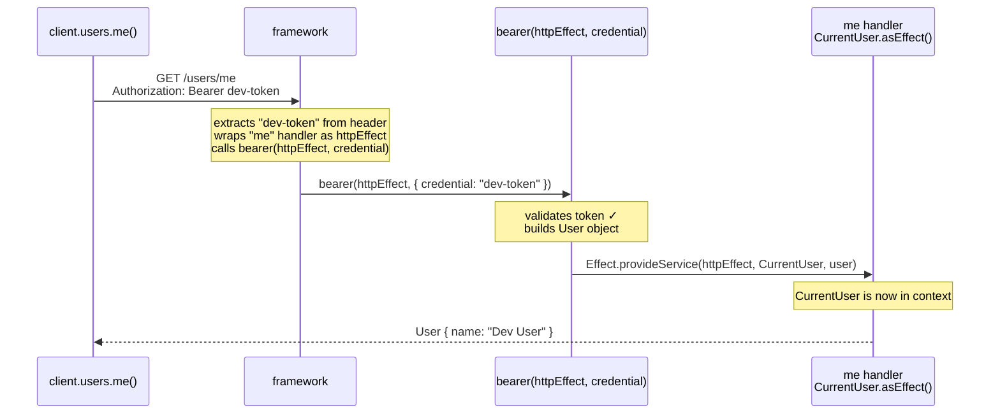

# Effect v4: Per-Execution Injection (`Effect.provideService`)

Instead of building a layer, inject a single service instance directly into an in-flight effect at the point it is run.

## `Effect.provideService` signature

`refs/effect4/packages/effect/src/Effect.ts:5929`

```ts
export const provideService: {
  <I, S>(service: Context.Key<I, S>): {
    (implementation: S): <A, E, R>(self: Effect<A, E, R>) => Effect<A, E, Exclude<R, I>>
    <A, E, R>(self: Effect<A, E, R>, implementation: S): Effect<A, E, Exclude<R, I>>
  }
  <I, S>(service: Context.Key<I, S>, implementation: S):
    <A, E, R>(self: Effect<A, E, R>) => Effect<A, E, Exclude<R, I>>
  <A, E, R, I, S>(self: Effect<A, E, R>, service: Context.Key<I, S>, implementation: S):
    Effect<A, E, Exclude<R, I>>
}
```

`Exclude<R, I>` — the service requirement `I` is removed from the type after injection. The returned effect no longer requires `I` from the caller.

## Example — HTTP auth middleware

`refs/effect4/ai-docs/src/51_http-server/fixtures/server/Authorization.ts:24`
`refs/effect4/ai-docs/src/51_http-server/10_basics.ts:68`

### Step 1 — the handler needs a `CurrentUser`

First, what `handle` expects. From `HttpApiEndpoint.ts:593`:

```ts
type Handler<Endpoint, E, R> = (
  request: Request<Endpoint>
) => Effect<SuccessType, ErrorType, R>
//   ^^^^^^ must return an Effect
```

The handler must be a function that returns an `Effect`. So this would be a TypeScript error:

```ts
.handle("me", () => CurrentUser)  // ✗ CurrentUser is a tag, not an Effect
```

`CurrentUser` is a tag — it is the key used to look up a value in the context. It is not a value itself, and it is not an `Effect`.

`.asEffect()` is a method on every `Context.Service` tag. It converts the tag into an `Effect` that reads the service out of context and returns it. From `Context.ts:49`:

```ts
asEffect(): Effect<Shape, never, Identifier>
//          Effect<User,  never, CurrentUser>  ← for CurrentUser specifically
```

So these three are identical:

```ts
// 1. using asEffect()
.handle("me", () => CurrentUser.asEffect())

// 2. using yield* inside Effect.gen
.handle("me", () =>
  Effect.gen(function*() {
    return yield* CurrentUser
  })
)

// 3. explicit — just to make the lookup visible
.handle("me", () =>
  Effect.gen(function*() {
    const user = yield* CurrentUser  // reads User out of context
    return user
  })
)
```

All three return `Effect<User, never, CurrentUser>` — an effect that, when run, looks up `CurrentUser` in the context and returns the `User` stored there.

The handler doesn't know anything about tokens. It just asks for `CurrentUser` and expects something to have put it in the context before this runs.

### Step 2 — `bearer` is the thing that puts `CurrentUser` in the context

`bearer` is a function. It receives two arguments:
- `httpEffect` — the downstream handler effect (the `me` handler above), not yet run
- `credential` — the bearer token extracted from the request header

```ts
// server/Authorization.ts
bearer: Effect.fn(function*(httpEffect, { credential }) {

  // validate the token
  if (Redacted.value(credential) !== "dev-token") {
    return yield* new Unauthorized({ message: "Missing or invalid bearer token" })
  }

  // token is valid — build the user and inject it into the handler effect
  const user = new User({ id: UserId.make(1), name: "Dev User", email: "dev@acme.com" })

  return yield* Effect.provideService(
    httpEffect,   // the "me" handler — CurrentUser.asEffect()
    CurrentUser,  // the tag to inject
    user          // the value
  )
  // now when httpEffect runs, CurrentUser.asEffect() resolves to `user`
})
```

`Effect.provideService(httpEffect, CurrentUser, user)` wraps `httpEffect` so that when it runs, `CurrentUser` is already in its context. The handler never sees this wiring.

### Step 3 — the client sends the token

On the client side, every request gets the bearer token attached automatically:

```ts
// 10_basics.ts:68
const AuthorizationClient = HttpApiMiddleware.layerClient(
  Authorization,
  Effect.fn(function*({ next, request }) {
    return yield* next(HttpClientRequest.bearerToken(request, "dev-token"))
  })
)
```

Then calling the `me` endpoint:

```ts
// 10_basics.ts:110
const whoAmI = Effect.gen(function*() {
  const client = yield* ApiClient
  return yield* client.users.me()
}).pipe(Effect.provide(ApiClient.layer))
```

### Step 4 — how it all connects



The key: `bearer` receives the `me` handler as `httpEffect` before it runs. It puts `CurrentUser` into that effect's context using `Effect.provideService`, then yields the wrapped effect. The handler runs inside that wrapper and finds `CurrentUser` waiting.
