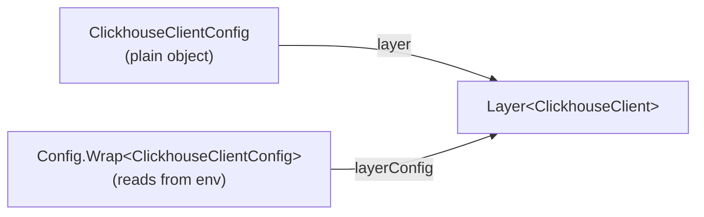
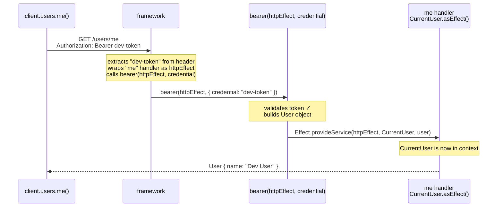

# Effect v4: Runtime Injection Patterns

Two idiomatic ways to inject a runtime value (auth token, tenant id, config) into the Effect context.

```
Pattern A: layer factory         layer(runtimeValue) → Layer<Service>
Pattern B: per-execution inject  Effect.provideService(effect, Tag, value)
```

Both are used in Effect v4's own source and docs. `AdminApi.layerFor(auth)` is Pattern A.

---

## Pattern A: Layer Factory

A static method that takes a runtime value and returns a `Layer`.

```
runtime value
    │
    ▼
layer(value) ──► Layer<Service>
                      │
                      ▼
             effect.pipe(Effect.provide(layer))
```

### Example 1 — `DatabasePool.layer(tenantId)`

`refs/effect4/ai-docs/src/01_effect/04_resources/30_layer-map.ts:27`

```ts
export class DatabasePool extends Context.Service<DatabasePool, {
  readonly tenantId: string
  readonly connectionId: number
  readonly query: (sql: string) => Effect.Effect<ReadonlyArray<UserRecord>, DatabaseQueryError>
}>()("app/DatabasePool") {
  static readonly layer = (tenantId: string) =>
    Layer.effect(
      DatabasePool,
      Effect.acquireRelease(
        Effect.sync(() => DatabasePool.of({
          tenantId,
          connectionId: ++nextConnectionId,
          query: Effect.fn("DatabasePool.query")((_sql) =>
            Effect.succeed([{ id: 1, email: `admin@${tenantId}.example.com` }])
          )
        })),
        (pool) => Effect.logInfo(`Closing tenant pool ${pool.tenantId}#${pool.connectionId}`)
      )
    )
}
```

Usage — tenant id comes in at request time, not at app startup:

```ts
queryUsersForCurrentTenant.pipe(
  Effect.provide(DatabasePool.layer("acme"))  // ← runtime tenantId
)
```

`layerFor` in `AdminApi` follows the same shape exactly:

```ts
static readonly layerFor = (admin: ShopifyAdminContext) =>
  this.layer.pipe(Layer.provide(Layer.succeed(AdminContext, admin)));
```

- `tenantId` → `admin` (arrives at request time, not boot time)
- `DatabasePool` → `AdminApi` (service built from that runtime value)

### Example 2 — `MessageStore.layerRemote(url)`

`refs/effect4/ai-docs/src/01_effect/02_services/20_layer-unwrap.ts:31`

Shows a service with *multiple* named layer factories, each for a different configuration source:

```ts
export class MessageStore extends Context.Service<MessageStore, {
  append(message: string): Effect.Effect<void>
  readonly all: Effect.Effect<ReadonlyArray<string>>
}>()("myapp/MessageStore") {
  static readonly layerInMemory = Layer.effect(...)        // no config needed

  static readonly layerRemote = (url: URL) =>              // ← factory: url at runtime
    Layer.effect(
      MessageStore,
      Effect.try({
        try: () => MessageStore.of({
          append: (message) => Effect.sync(() => { messages.push(`[${url.host}] ${message}`) }),
          all: Effect.sync(() => [...messages])
        }),
        catch: (cause) => new MessageStoreError({ cause })
      })
    )

  static readonly layer = Layer.unwrap(                    // config-driven selector
    Effect.gen(function*() {
      const useInMemory = yield* Config.boolean("MESSAGE_STORE_IN_MEMORY").pipe(Config.withDefault(false))
      if (useInMemory) return MessageStore.layerInMemory
      const remoteUrl = yield* Config.url("MESSAGE_STORE_URL")
      return MessageStore.layerRemote(remoteUrl)           // ← calls factory
    })
  )
}
```

The layer name convention (`layerInMemory`, `layerRemote`, `layerFor`) is just a local naming choice — the underlying pattern is identical.

### Example 3 — `ClickhouseClient.layer(config)` / `layerConfig(config)`

`refs/effect4/packages/sql/clickhouse/src/ClickhouseClient.ts:397,417`

The `@effect/sql` Clickhouse client is a production library. It ships two layer factories — one for a plain config object, one for a `Config.Wrap` (reads from env/config system):



Both functions have the same shape: **`(input) → Layer`**. Only the input source differs.

```ts
export const layer = (config: ClickhouseClientConfig) =>
  Layer.effectContext(...)   // builds ClickhouseClient from plain object

export const layerConfig = (config: Config.Wrap<ClickhouseClientConfig>) =>
  Layer.effectContext(...)   // builds ClickhouseClient by reading env/config first
```

Point: a production Effect library treats layer factories as the standard API surface. `layerFor`, `layerRemote`, `layer(tenantId)` are all the same idiom with different names.

---

## Pattern B: Per-Execution Injection (`Effect.provideService`)

Instead of building a layer, inject a single service instance directly into an in-flight effect at the point it is run.

### `Effect.provideService` signature

`refs/effect4/packages/effect/src/Effect.ts:5929`

```ts
export const provideService: {
  <I, S>(service: Context.Key<I, S>): {
    (implementation: S): <A, E, R>(self: Effect<A, E, R>) => Effect<A, E, Exclude<R, I>>
    <A, E, R>(self: Effect<A, E, R>, implementation: S): Effect<A, E, Exclude<R, I>>
  }
  <I, S>(service: Context.Key<I, S>, implementation: S):
    <A, E, R>(self: Effect<A, E, R>) => Effect<A, E, Exclude<R, I>>
  <A, E, R, I, S>(self: Effect<A, E, R>, service: Context.Key<I, S>, implementation: S):
    Effect<A, E, Exclude<R, I>>
}
```

`Exclude<R, I>` — the service requirement `I` is removed from the type after injection.

### Example — HTTP auth middleware

`refs/effect4/ai-docs/src/51_http-server/fixtures/server/Authorization.ts:24`
`refs/effect4/ai-docs/src/51_http-server/10_basics.ts:68`

#### Step 1 — the handler needs a `CurrentUser`

First, what `handle` expects. From `HttpApiEndpoint.ts:593`:

```ts
type Handler<Endpoint, E, R> = (
  request: Request<Endpoint>
) => Effect<SuccessType, ErrorType, R>
//   ^^^^^^ must return an Effect
```

The handler must be a function that returns an `Effect`. So this would be a TypeScript error:

```ts
.handle("me", () => CurrentUser)  // ✗ CurrentUser is a tag, not an Effect
```

`CurrentUser` is a tag — it is the key used to look up a value in the context. It is not a value itself, and it is not an `Effect`.

`.asEffect()` is a method on every `Context.Service` tag. It converts the tag into an `Effect` that reads the service out of context and returns it. From `Context.ts:49`:

```ts
asEffect(): Effect<Shape, never, Identifier>
//          Effect<User,  never, CurrentUser>  ← for CurrentUser specifically
```

So these three are identical:

```ts
// 1. using asEffect()
.handle("me", () => CurrentUser.asEffect())

// 2. using yield* inside Effect.gen
.handle("me", () =>
  Effect.gen(function*() {
    return yield* CurrentUser
  })
)

// 3. explicit — just to make the lookup visible
.handle("me", () =>
  Effect.gen(function*() {
    const user = yield* CurrentUser  // reads User out of context
    return user
  })
)
```

All three return `Effect<User, never, CurrentUser>` — an effect that, when run, looks up `CurrentUser` in the context and returns the `User` stored there.

The handler doesn't know anything about tokens. It just asks for `CurrentUser` and expects something to have put it in the context before this runs.

#### Step 2 — `bearer` is the thing that puts `CurrentUser` in the context

`bearer` is a function. It receives two arguments:
- `httpEffect` — the downstream handler effect (the `me` handler above), not yet run
- `credential` — the bearer token extracted from the request header

```ts
// server/Authorization.ts
bearer: Effect.fn(function*(httpEffect, { credential }) {

  // validate the token
  if (Redacted.value(credential) !== "dev-token") {
    return yield* new Unauthorized({ message: "Missing or invalid bearer token" })
  }

  // token is valid — build the user and inject it into the handler effect
  const user = new User({ id: UserId.make(1), name: "Dev User", email: "dev@acme.com" })

  return yield* Effect.provideService(
    httpEffect,   // the "me" handler — CurrentUser.asEffect()
    CurrentUser,  // the tag to inject
    user          // the value
  )
  // now when httpEffect runs, CurrentUser.asEffect() resolves to `user`
})
```

`Effect.provideService(httpEffect, CurrentUser, user)` wraps `httpEffect` so that when it runs, `CurrentUser` is already in its context. The handler never sees this wiring.

#### Step 3 — the client sends the token

On the client side, every request gets the bearer token attached automatically:

```ts
// 10_basics.ts:68
const AuthorizationClient = HttpApiMiddleware.layerClient(
  Authorization,
  Effect.fn(function*({ next, request }) {
    return yield* next(HttpClientRequest.bearerToken(request, "dev-token"))
  })
)
```

Then calling the `me` endpoint:

```ts
// 10_basics.ts:110
const whoAmI = Effect.gen(function*() {
  const client = yield* ApiClient
  return yield* client.users.me()
}).pipe(Effect.provide(ApiClient.layer))
```

#### Step 4 — how it all connects



The key: `bearer` receives the `me` handler as `httpEffect` before it runs. It puts `CurrentUser` into that effect's context using `Effect.provideService`, then yields the wrapped effect. The handler runs inside that wrapper and finds `CurrentUser` waiting.

---

## Pattern A vs Pattern B

| | Pattern A: layer factory | Pattern B: `Effect.provideService` |
|---|---|---|
| What you get | `Layer<Service>` | `Effect<A, E, Exclude<R, I>>` |
| How applied | `Effect.provide(layer)` | directly wraps effect |
| Service deps | layer can compose other layers | single service, no sub-deps |
| Caching | layers can be cached/scoped | no caching |
| Use when | service has its own dependencies or initialization logic | injecting a plain value/object that is already in hand |

`AdminApi` needs its own `make` logic (yields `AdminContext`, calls `admin.graphql`), so Pattern A (layer factory) is the right fit. Pattern B works for `AdminContext` itself — which is exactly how `layerFor` composes them:

```ts
static readonly layerFor = (admin: ShopifyAdminContext) =>
  this.layer.pipe(
    Layer.provide(
      Layer.succeed(AdminContext, admin)  // ← Pattern B style: plain value → Layer.succeed
    )
  )
```

`Layer.succeed` is the layer-world equivalent of `Effect.provideService` for values that need no acquisition logic.

---

## How `AdminApi.layerFor` fits

```
ShopifyServerFnMiddleware
     │
     ├─ context.runEffect(authenticateAdmin(request))
     │       └─► ShopifyAdminContext (auth)
     │
     ├─ AdminApi.layerFor(auth)
     │       ├─ Layer.succeed(AdminContext, auth)   ← Pattern B: value already in hand
     │       └─ AdminApi.layer                      ← Pattern A: service with deps
     │
     └─ override runEffect to Effect.provide(AdminApi.layerFor(auth))

Handler
     └─ yield* AdminApi     ← no knowledge of auth wiring
```

The middleware-time provision is the same mechanism as `Authorization.bearer` injecting `CurrentUser` — both authenticate, then inject into the downstream execution context.
