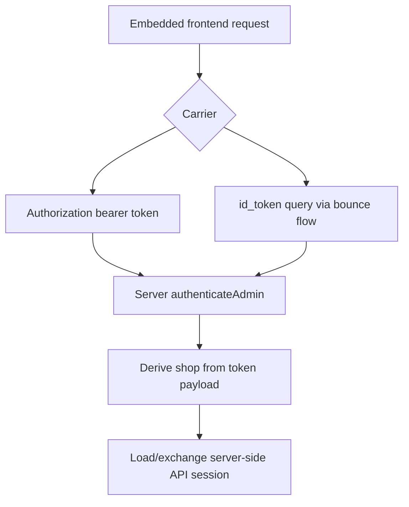

# Shopify auth in TanStack Start (consolidated)

## TL;DR

- Shopify requirement for embedded apps: frontend -> backend requests must use Shopify session tokens.
- Session tokens are client-originated via App Bridge, short-lived, and used for authentication only.
- The Shopify template is not bypassing this requirement; much token plumbing is implicit in App Bridge + Shopify server helpers.
- Template pattern is recommended and solid: authenticate every server request, derive `shop` server-side from validated token/session.
- Current repo is only partially aligned: document route auth is good, server-fn auth still needs explicit middleware.

## Non-contradictory facts

### 1) Shopify requires session-token auth for embedded frontend -> backend

Shopify docs:

> "Your app's frontend must acquire a session token from App Bridge... You must include the token in the AUTHORIZATION header for all requests to the app's backend."

Source: `refs/shopify-docs/docs/apps/build/authentication-authorization/access-tokens/token-exchange.md`

Shopify docs also state:

> "All apps rendered in the Shopify admin need to use session tokens because third-party cookies won't work..."

Source: `refs/shopify-docs/docs/apps/build/authentication-authorization/session-tokens.md`

### 2) Current App Bridge can make this look implicit

Shopify docs:

> "The current version of App Bridge automatically adds session tokens to requests coming from your app."

Source: `refs/shopify-docs/docs/apps/build/authentication-authorization/session-tokens/set-up-session-tokens.md`

This is why template route files often do not show manual `getSessionToken(...)` calls.

### 3) Shopify server helper accepts two token carriers

- `Authorization: Bearer <token>`
- `id_token` query param

Source: `refs/shopify-app-js/packages/apps/shopify-app-react-router/src/server/authenticate/helpers/get-session-token-header.ts`

For missing `id_token` in embedded document flow, helper bounces to `/auth/session-token`.

Source: `refs/shopify-app-js/packages/apps/shopify-app-react-router/src/server/authenticate/admin/helpers/ensure-session-token-search-param-if-required.ts`
Source: `refs/shopify-app-js/packages/apps/shopify-app-react-router/src/server/authenticate/admin/helpers/redirect-to-bounce-page.ts`

Tests confirm this behavior.

Source: `refs/shopify-app-js/packages/apps/shopify-app-react-router/src/server/authenticate/admin/__tests__/doc-request-path.test.ts`
Source: `refs/shopify-app-js/packages/apps/shopify-app-react-router/src/server/authenticate/admin/__tests__/patch-session-token-path.test.ts`

## How the template actually works

- `/app` loader authenticates via `authenticate.admin(request)` and returns only `apiKey`.
- index loader/action also call `authenticate.admin(request)` per request.
- client does not carry `shop` as auth proof.

Source: `refs/shopify-app-template/app/routes/app.tsx`
Source: `refs/shopify-app-template/app/routes/app._index.tsx`

Server library derives `shop` from validated token payload (`dest`) before session lookup/exchange.

Source: `refs/shopify-app-js/packages/apps/shopify-app-react-router/src/server/authenticate/admin/authenticate.ts`

## Is template approach "good" or "expedient"?

Good. This is aligned with Shopify's recommended libraries/templates and auth model.

Source: `refs/shopify-docs/docs/apps/build/authentication-authorization/access-tokens.md`

## What to store and where

- Session token: do not persist; treat as per-request auth material.
- Access tokens (online/offline): store server-side in session storage/db.

Source: `refs/shopify-docs/docs/apps/build/authentication-authorization/session-tokens.md`
Source: `refs/shopify-docs/docs/apps/build/authentication-authorization/access-tokens/token-exchange.md`

## Where this repo stands now

### Already aligned

- `/app` boundary auth in `beforeLoad` path via `shopify.authenticateAdmin(...)`.

Source: `src/routes/app.tsx`

### Not fully aligned yet

- `generateProduct` server function calls server auth, but client RPC path does not currently guarantee session-token header injection.
- TanStack server-fn transport only sends headers you explicitly add.

Source: `src/routes/app.index.tsx`
Source: `refs/tan-start/packages/start-client-core/src/client-rpc/serverFnFetcher.ts`

## Implementation for this repo

Yes, this should use TanStack server-function middleware.

Grounding from `refs/tan-start`:

- server-function middleware is attached via `createServerFn().middleware([mw])`
- client middleware can set request headers via `next({ headers: ... })`
- server middleware can inject validated context via `next({ context: ... })`

Source: `refs/tan-start/docs/start/framework/react/guide/middleware.md`

### 1) Add middleware (`src/lib/ShopifyServerFnMiddleware.ts`)

```ts
import { createMiddleware } from "@tanstack/react-start";
import { Effect } from "effect";

import { Request as AppRequest } from "@/lib/Request";
import { Shopify } from "@/lib/Shopify";

interface ShopifyGlobal {
  readonly idToken?: () => Promise<string>;
  readonly auth?: {
    readonly idToken?: () => Promise<string>;
  };
}

const getSessionToken = async () => {
  const shopify = (globalThis as typeof globalThis & { readonly shopify?: ShopifyGlobal }).shopify;
  const token = shopify?.idToken
    ? await shopify.idToken()
    : await shopify?.auth?.idToken?.();
  if (!token) {
    throw new TypeError("Missing Shopify App Bridge session token");
  }
  return token;
};

export const shopifyServerFnMiddleware = createMiddleware({ type: "function" })
  .client(async ({ next }) => {
    const token = await getSessionToken();
    return next({ headers: { Authorization: `Bearer ${token}` } });
  })
  .server(async ({ next, context }) => {
    const auth = await context.runEffect(
      Effect.gen(function* () {
        const shopify = yield* Shopify;
        const request = yield* AppRequest;
        return yield* shopify.authenticateAdmin(request);
      }),
    );
    if (auth instanceof Response) {
      throw new TypeError(`Unexpected Shopify auth response: ${String(auth.status)}`);
    }
    return next({ context: { admin: auth, session: auth.session } });
  });
```

### Where `globalThis.shopify` comes from

- In this repo, `AppProvider` injects Shopify's App Bridge script tag:
  - `<script src={APP_BRIDGE_URL} data-api-key={apiKey} />`
  - `APP_BRIDGE_URL = "https://cdn.shopify.com/shopifycloud/app-bridge.js"`
- That downloaded script executes in the browser and exposes the App Bridge APIs via the global `shopify` object.

Source: `src/components/AppProvider.tsx`

Shopify docs explicitly describe this model:

> "The APIs in Shopify's App Bridge library provide this functionality through the `shopify` global variable."

> "Loading App Bridge in your app from cdn.shopify.com/shopifycloud/app-bridge.js installs the latest version of the library."

Source: `refs/shopify-docs/docs/api/app-home.md`

Operationally: if App Bridge script is not loaded (or app not running embedded), `globalThis.shopify` may be undefined, so middleware should fail fast with a clear auth error.

Client token call is grounded by Shopify App Home docs (`shopify.idToken()` + `Authorization`):

Source: `refs/shopify-docs/docs/api/app-home.md`

### 2) Use middleware in server functions

```ts
const generateProduct = createServerFn({ method: "POST" })
  .middleware([shopifyServerFnMiddleware])
  .handler(({ context: { admin, runEffect } }) =>
    runEffect(
      Effect.gen(function* () {
        const productCreateResponse = yield* admin.graphql(`...`, {
          variables: { product: { title: "Red Snowboard" } },
        });
        return yield* Effect.tryPromise(() => productCreateResponse.json());
      }),
    ),
  );
```

### 3) Remove client `shop` auth input from server-fn path

- keep `shop` in route context only for UI/state if needed
- do not use client-provided `shop` as auth proof
- server derives shop from validated token payload in `authenticateAdmin`

Source: `src/lib/Shopify.ts`

## One diagram



## Final answer to the confusion

There is no conflict between "Shopify insists on client session token" and "template has little/no explicit client token code".

- The requirement is real.
- The template satisfies it with framework/runtime helpers, so route code looks simpler.
